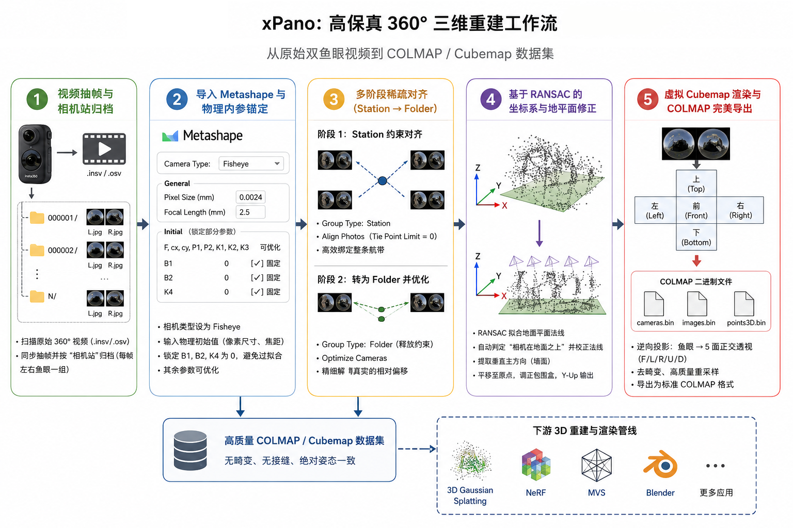
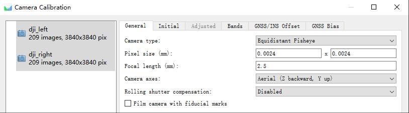
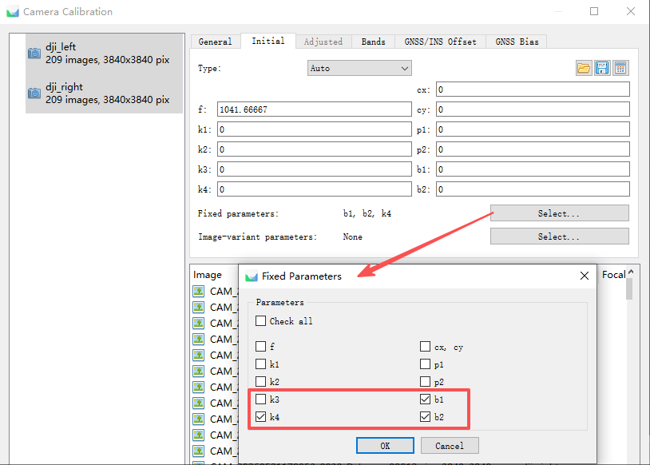
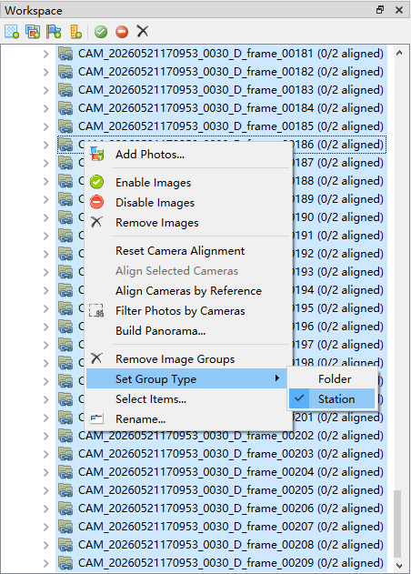
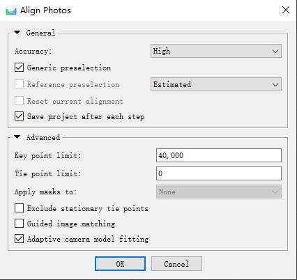

# xPano: High-Fidelity 3D Reconstruction Workflow for 360° Cameras

[](#)
[](#)

xPano is an end-to-end 3D reconstruction alignment and data conversion workflow designed specifically for dual-lens 360° cameras (such as Insta360, DJI Osmo 360, etc.).

Traditional panoramic reconstruction pipelines often rely on proprietary software to stitch dual-fisheye frames into Equirectangular Projection (ERP) panoramas, which are then sliced into several perspective images at specific offset angles. This practice introduces irreversible non-linear distortions and stitching seams in computer vision and photogrammetry. xPano redefines this approach by using raw dual-fisheye images directly for aerial triangulation (Structure from Motion). It locks geometric fidelity through rigorous Camera Station constraints and physical camera calibration. Once the sparse reconstruction is aligned, it utilizes a reverse-projection remapping algorithm to slice the fisheye frames into high-quality Virtual Cubemaps, seamlessly adapting to downstream 3D Gaussian Splatting (3DGS) and Neural Radiance Fields (NeRF) pipelines.

[中文文档](README.zh-CN.md)



---

## The Core Philosophy: Why We Avoid Stitched Panoramas (ERP)

While stitched panoramas perform exceptionally in visual presentation, they are a disastrous data source in rigorous photogrammetry and bundle adjustment. A 360° camera is physically composed of two back-to-back fisheye lenses separated by a baseline of a few centimeters. To eliminate visual stitching artifacts, stitching software applies dynamic optical flow warping and non-rigid local stretching to force-align the seams. This warping is mathematically arbitrary and non-physical, completely violating the inherent collinearity equations of optical lenses. Reconstruction algorithms cannot establish a stable camera calibration model to fit such dynamically altered imagery, ultimately causing the reconstructed sparse tie points to drift and double near the stitching seams, or even causing systemic bending of the camera trajectory.

Furthermore, Equirectangular Projection (ERP) exhibits severe polar stretching singularities. When the spherical coordinates are mapped onto a 2D plane, the polar regions (zenith and nadir) suffer from massive pixel stretching. This extreme pixel expansion causes feature extractors to capture a large number of meaningless elongated lines, resulting in severe noise and structural collapse in the sky and ground regions of the 3D reconstruction.

Similarly, workflows that pre-slice a stitched ERP panorama into multiple perspective images before performing alignment introduce major computational inefficiencies. Slicing each panorama into 4 to 8 perspective frames prior to alignment scales up the total number of images exponentially. In photogrammetry, the computational complexity of feature matching and bundle adjustment grows geometrically with the image count. Aligning massive numbers of pre-sliced perspective images directly leads to exceedingly long processing times, and often causes system crashes due to memory exhaustion.

Slicing before alignment also encounters a geometric bottleneck in weak-feature areas like the sky. When slicing a panorama, users typically extract a horizontal ring of perspective images. Even with vertical pitch adjustments, the absolute zenith (directly overhead) remains a challenge. The sky contains virtually no stable, extractable feature points. If sky-facing slices are matched as independent cameras, the bundle adjustment solver fails to locate them due to the absence of valid tie points, causing these slices to either fail to align or drift randomly in 3D space, corrupting the camera trajectory.

xPano bypasses these limitations by performing the initial sparse alignment on the raw `.insv` or `.osv` dual-fisheye images directly. Only two fisheye images per frame enter the initial bundle adjustment, keeping the total image count minimal and reducing alignment times by several orders of magnitude. Under the strong physical constraint of a "Camera Station," the featureless sky regions (located at the periphery of the fisheye lens) and the feature-rich ground or wall regions (located in the center of the same fisheye frame) are rigidly locked within the same sensor's coordinate system. This allows the camera poses of featureless sky regions to be solved implicitly through the physical rigidity of the camera body, without relying on unstable sky feature points.

Once the camera trajectory is aligned and locked, the virtual cubemap slicing is executed as a post-processing step during the final COLMAP export. This moves the heavy calculations of slicing and undistortion to a single-pass linear pixel resampling phase, removing them from the iterative bundle adjustment loop. This not only yields major speed gains but also ensures that the exported perspective images possess highly accurate poses, eliminating systematic geometric errors caused by non-rigid stitching and polar stretching.

---

## Quick Start and Operational Guide

### Step 1: Video Frame Extraction and Camera Station Archiving

Run the provided `pano_extractor.py` script to scan and extract synchronized frames from raw `.insv` or `.osv` panoramic video streams in your working directory.

```bash
python scripts/pano_extractor.py
```

The script extracts the images and automatically creates a dedicated subfolder for each frame, grouping the corresponding left and right fisheye images together. In photogrammetry, this is referred to as a "Camera Station." The relative pose of the dual lenses is physically fixed. Grouping the synchronized left and right fisheyes under the same Camera Station allows the alignment solver to utilize a strong physical prior during the subsequent sparse reconstruction.

---

### Step 2: Metashape Import and Physical Calibration Anchor

Import the generated Camera Station directory structure into Agisoft Metashape. Before running the alignment, you must manually configure the camera calibration parameters. This step is critical to achieving stable alignment and geometric accuracy.

Open the `Tools -> Camera Calibration` window. In the General tab, change the **Camera Type** from the default Frame to **Fisheye**.

Manually input the initial physical parameters in the General tab: set the **Pixel Size (mm)** to **0.0024** and the **Focal Length (mm)** to **2.5**.



This step provides the non-linear bundle adjustment solver with a physically plausible initial focal length ($Initial\ Value$). While individual cameras exhibit minor manufacturing tolerances, entering these values ensures that the initial pixel focal length ($f$) calculated by the software is in the correct order of magnitude. This prevents the solver from converging to a local minimum when EXIF data is missing, which often manifests as a curved "banana" reconstruction or stratified point clouds.

$$f_{\text{pixel}} = \frac{f_{\text{mm}}}{\text{Pixel Size}_{\text{mm}}}$$

Next, switch to the **Initial** tab to enforce strict parameter locking:
- Set **B1, B2, and K4** to **0** and **check the corresponding "Fix" boxes** to lock them completely.
- Keep the focal length (F), pixel size, principal point (cx, cy), and **P1, P2, K1, K2, K3** as adjustable/optimizable parameters.



Modern panoramic lenses are manufactured to high precision. The parameters B1 and B2, which describe thin-prism de-centering distortion, are physically negligible in consumer-grade sensors. Allowing the software to optimize B1 and B2 often leads to overfitting, where the solver absorbs image noise and destabilizes the camera calibration. Similarly, for consumer fisheye lenses, third-order radial distortion parameters K1, K2, and K3 provide sufficient degrees of freedom to model the optical curvature. The higher-order K4 parameter tends to correlate heavily with K3, causing parameter oscillation. Locking K4 stabilizes the radial distortion curve and accelerates bundle adjustment convergence.

---

### Step 3: Multi-Stage Sparse Alignment (From Station to Folder)

The relative orientation between dual-lens systems is highly sensitive. Forcing a rigid Camera Rig constraint during the initial alignment can cause the alignment to fail if the initial relative pose calibration is slightly off. To bypass this, xPano uses a two-stage alignment strategy: "constrain first, release later."

**Stage 1:** Before running the alignment, select all imported cameras, right-click, and change their **Group Type** to **Station**. This mathematically constrains the physical centers of the left and right cameras to the exact same spatial coordinate, allowing only rotational differences.



Under this constraint, run **Align Photos** and set the **Tie Point Limit** to **0** (unlimited). The solver will establish a global coordinate framework with high efficiency, anchoring the camera poses securely.



**Stage 2:** Once the initial sparse alignment is successful, select all camera groups in the Workspace and change their **Group Type** back to **Folder** (releasing the zero-baseline constraint). Then, click **Tools -> Optimize Cameras**. The solver will now optimize the camera poses to resolve the actual minor physical baseline offset and precise individual rotations. This two-stage strategy avoids initialization failures and recovers the true physical trajectory.

---

### Step 4: RANSAC-Based Automatic Coordinate and Ground Plane Correction

In reconstructions without GPS metadata, the sparse point cloud is generated with arbitrary orientation and is often tilted or upside down. To correct this and align the scene with standard 3D rendering coordinate systems, run the `align_ground_plane.py` script.

```bash
# Execute within the Metashape scripting console or menu
scripts/align_ground_plane.py
```

The script scans the sparse tie points and fits a ground plane using the RANSAC (Random Sample Consensus) algorithm. If you manually select a group of ground points in the interface before running the script, it will prioritize those selected points for high-precision fitting.

Once the ground plane is determined, the script calculates the average center of all cameras to verify the "cameras above ground" physical reality, automatically flipping the normal vector if necessary to ensure "up" is oriented correctly. It then detects perpendicular vertical planes (such as walls) to define the primary forward direction. Finally, the script applies a coordinate transformation matrix to center the scene at the origin, adjust the bounding box (Region), and optionally convert the coordinate system to the **Y-Up** standard utilized by WebGL and 3DGS renderers.

---

### Step 5: Virtual Cubemap Rendering and Perfect COLMAP Export

This is the core conversion engine of the xPano workflow. Running the `export_colmap.py` script transforms your aligned, calibrated fisheye dataset into undistorted perspective camera outputs in COLMAP format.

```bash
# Run this script within Metashape using the "Run Script" command
scripts/export_colmap.py
```

#### Prerequisite (Installing Bundled Python Dependencies)

Since Agisoft Metashape runs within its own bundled Python environment rather than the system's global Python environment, running `pip install opencv-python` in your standard terminal will lead to a `ModuleNotFoundError: No module named 'cv2'` error.

Before running the script, please open your Terminal or Command Prompt (with Administrator privileges on Windows) and execute the corresponding command to install the required dependency into Metashape's dedicated environment:

* **Windows (Default Path):**
  ```bash
  "C:\Program Files\Agisoft\Metashape Pro\python\python.exe" -m pip install opencv-python
  ```
* **Windows (Custom or Portable Path Example):**
  ```bash
  "D:\3DGS\Metashape 2.3.1\App\Metashape\python\python.exe" -m pip install opencv-python
  ```
* **macOS:**
  ```bash
  /Applications/MetashapePro.app/Contents/MacOS/python/bin/python3 -m pip install opencv-python
  ```
* **Linux:**
  ```bash
  ./metashape-pro/python/bin/python -m pip install opencv-python
  ```

For standard perspective cameras (Frame), the script applies the optimized calibration parameters to perform radial and tangential undistortion, outputting clean perspective images.

For dual-fisheye cameras, the script uses the center of each Camera Station as an origin to render 5 virtual perspective views at $90^\circ$ orthogonal angles: **Front, Left, Right, Top, and Bottom**.

The script projects each pixel $(u, v)$ of the virtual perspective plane into a 3D ray direction vector $\vec{v}(X, Y, Z)$ in camera space. It then reads the optimized fisheye calibration parameters ($K_1, K_2, K_3, K_4, P_1, P_2, B_1, B_2$) to project $\vec{v}$ back onto the physical fisheye sensor coordinates, determining the exact source coordinates $(u_{\text{raw}}, v_{\text{raw}})$. The script utilizes OpenCV's `LANCZOS4` high-order interpolation to resample the pixels, preserving sharpness and eliminating aliasing.

To prevent Out-Of-Memory (OOM) failures when processing large datasets, the script features a memory-bounded batching architecture: it loads only one raw camera frame into memory at a time, spins up a limited ThreadPoolExecutor (5 threads) to render and write the 5 virtual perspective views to disk, and then immediately destroys the source frame pointer before proceeding to the next station.

Finally, the script packages the virtual perspective views, standard perspective images, and sparse point cloud into COLMAP binary files (`cameras.bin`, `images.bin`, `points3D.bin`). This format can be imported directly into any major 3DGS or NeRF engine. Because the rendered views cover the full sky dome, the resulting reconstruction avoids the stitching seams and polar warping artifacts associated with ERP workflows.
